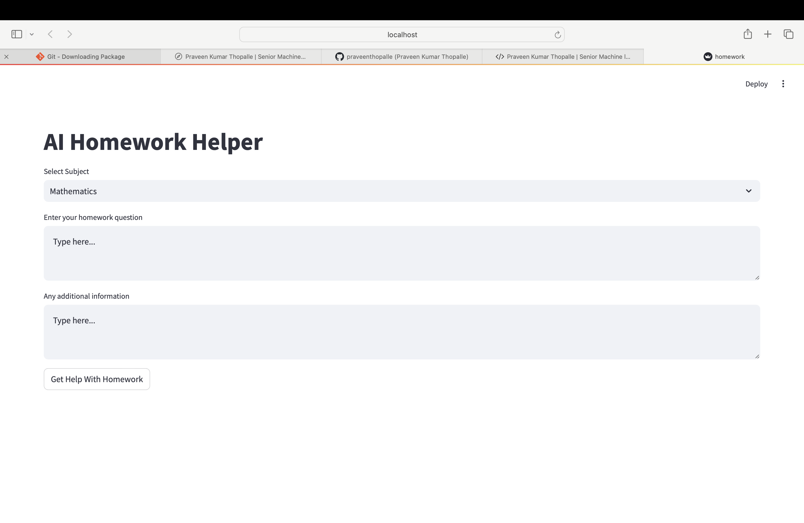
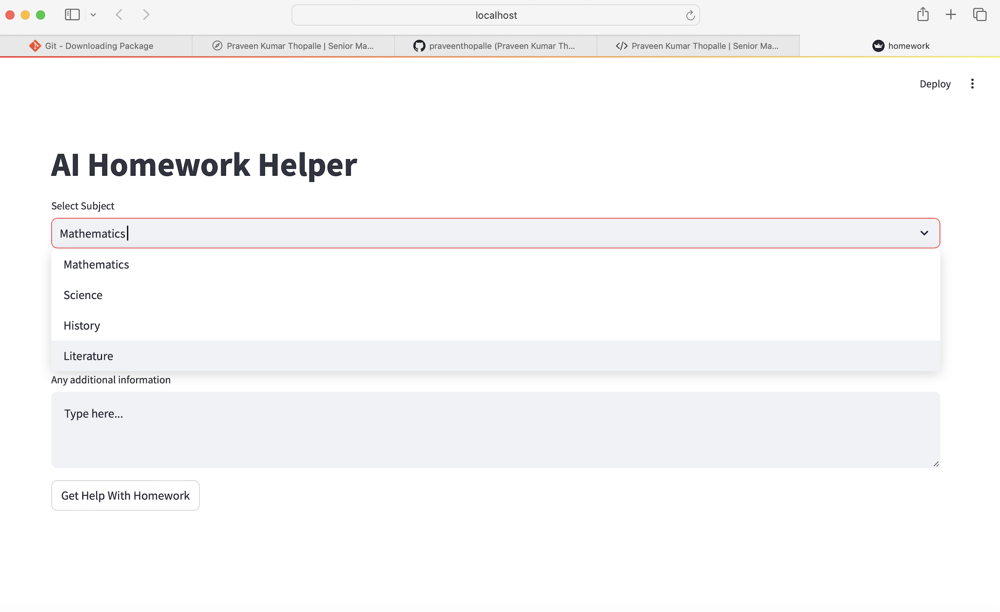

# AI-Agents-Streamlit-App
AI Agents Streamlit App using Crew AI to do home work for kids.

Here is out the UI Looks.

# This AI CHatbot will create a documentation of the step by step implementation of the homework.

# This application uses OpenAI LLM to GenerativeAI Text generation.

# This approach helps in reducing computation impact on our deployment systems, chat gpt will take that load.

# This approach can be leverage to use any Open source LLM Model as well.